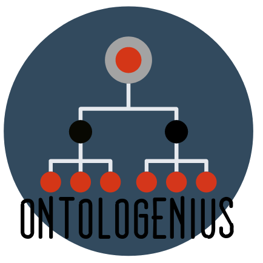

#  ontolo**G**enius
[![Release][Release-Image]][Release-Url]  Master : [](https://gitlab.com/sarthou/ontologenius/commits/master) Dev : [](https://gitlab.com/sarthou/ontologenius/commits/dev)


This repository is a ROS package to link, explore and interrogate ontologies.

***

[**Wiki homepage**](https://github.com/sarthou/ontologenius/wiki#-ontologenius)

[**1. Installation**](https://github.com/sarthou/ontologenius/wiki/Installation#installation)

[**2. Create ontology**](https://github.com/sarthou/ontologenius/wiki/Create-ontology)

[**3. Launch ontologenius**](https://github.com/sarthou/ontologenius/wiki/Launch-ontoloGenius)

[**4. Load ontology**](https://github.com/sarthou/ontologenius/wiki/Load-ontology)

[**5. Feed ontology**](https://github.com/sarthou/ontologenius/wiki/Feed-ontology)

[**6. Exploration**](https://github.com/sarthou/ontologenius/wiki/Exploration)
 - [**6.1. Classes exploration**](https://github.com/sarthou/ontologenius/wiki/Classes-exploration)
 - [**6.2. Properties exploration**](https://github.com/sarthou/ontologenius/wiki/Properties-exploration)
 - [**6.3. Individuals exploration**](https://github.com/sarthou/ontologenius/wiki/Individuals-exploration)

[**7. Reason**](https://github.com/sarthou/ontologenius/wiki/Reason)

[**8. Program with ontologenius**](https://github.com/sarthou/ontologenius/wiki/Program-with-ontoloGenius)

[**9. OntoloGUI**](https://github.com/sarthou/ontologenius/wiki/ontoloGUI)

***

## Run the package

A *.launch* file is available to run the package:
```sh
$ roslaunch ontologenius ontologenius.launch
```

On this launcher file, you will find an argument indicating the path to the ontology files.
> The default ontologies are very simple and I encourage you to contribute to their development!

You can add your own ontology files in the argument if you want them to be loaded at the beginning of the program.

[Release-Url]: https://sarthou.github.io/ontologenius/
[Release-image]: http://img.shields.io/badge/release-v0.2.4-1eb0fc.svg
