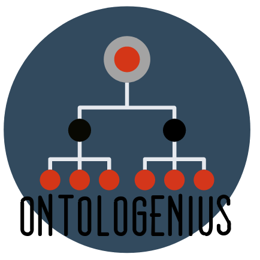

#  ontologenius
[![Release][Release-Image]][Release-Url]  Master : [](https://gitlab.com/sarthou/ontologenius/commits/master) Dev : [](https://gitlab.com/sarthou/ontologenius/commits/dev)


This repository is a ROS package to link, explore and interrogate ontologies.

For more information on using ontologenius, visit our website : https://sarthou.github.io/ontologenius/

***

## Run the package

Several *.launch* files are available to run the package, you can do a first try with:
```sh
$ roslaunch ontologenius ontologenius_full.launch
```

On this launcher file, you will find an argument indicating the path to the ontology files.
> The default ontologies are very simple and I encourage you to contribute to their development!

You can add your own ontology files in the argument if you want them to be loaded at the beginning of the program.

[Release-Url]: https://sarthou.github.io/ontologenius/
[Release-image]: http://img.shields.io/badge/release-v0.4.1-1eb0fc.svg
